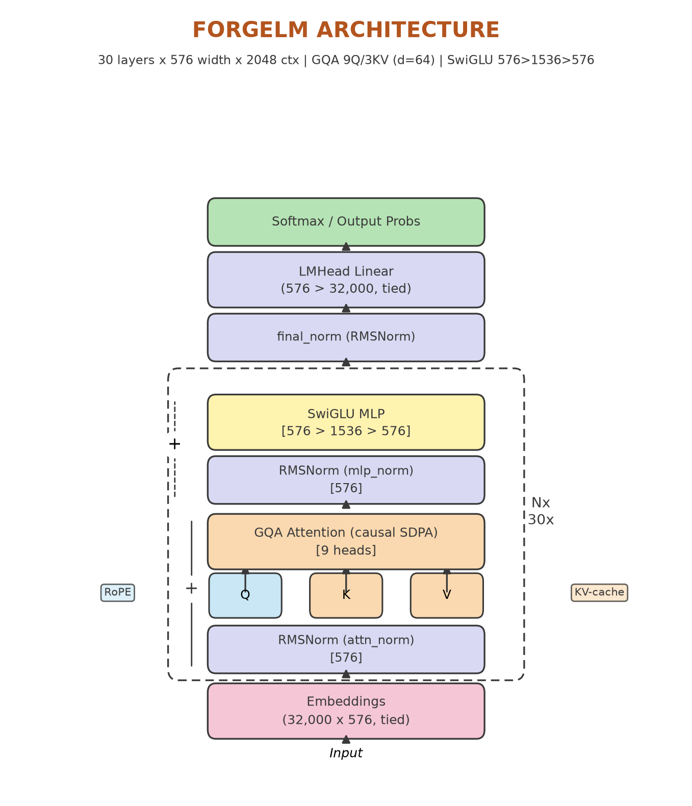

# ForgeLM

ForgeLM is an educational from-scratch language model: a LLaMA-style
decoder-only Transformer plus the complete pipeline around it — data,
pretraining, supervised fine-tuning, chat, and evaluation. Every stage is
deliberately simple, single-device code: the goal is to read it, understand
it, and reproduce it.

## Architecture

| Component | Choice |
|---|---|
| Type | Decoder-only pre-norm Transformer |
| Normalization | RMSNorm |
| Positions | Rotary embeddings (RoPE) |
| Attention | Grouped Query Attention (9 query / 3 KV heads), causal, via PyTorch SDPA (manual fallback kept for teaching) |
| MLP | SwiGLU |
| Embeddings | Tied input/output |
| Tokenizer | TinyLlama (32k vocabulary) |
| Reference size | 30 layers × 576 width × 2048 context ≈ 124.6M parameters |



## Results

Pretrained on ~1.7B tokens (FineWeb-Edu 75% / Cosmopedia-v2 15% / Python-Edu
10%) to `checkpoints/pretrain_base/step_006800.pt`, then fine-tuned on 200k
train examples of Smol-SmolTalk (test split kept full).

| Checkpoint | Val loss | Val ppl | HellaSwag | ARC-Easy |
|---|---|---|---|---|
| `pretrain_base`  | 2.244963 | 15.3009 | 0.276 | 0.462 |


Losses come from `eval/evaluate_loss.py`; benchmark scores from
`eval/evaluate_official.py` (lm-evaluation-harness, 0-shot).

## Quickstart

```bash
pip install -r requirements.txt
pip install -e .
pytest -q
```

## Data setup (run before pretrain or SFT)

Checkouts contain code and configs only — no token shards. Prepare them once:

```bash
# Pretrain corpus: 1.7B tokens total (75/15/10 mix).
python -m data_pipeline.pretrain_data tokenize \
    --dataset HuggingFaceTB/smollm-corpus \
    --dataset-config fineweb-edu-dedup --text-field text \
    --source fineweb-edu-dedup --output-root data/shards \
    --max-tokens 1275000000
python -m data_pipeline.pretrain_data tokenize \
    --dataset HuggingFaceTB/smollm-corpus \
    --dataset-config cosmopedia-v2 --text-field text \
    --source cosmopedia-v2 --output-root data/shards \
    --max-tokens 255000000
python -m data_pipeline.pretrain_data tokenize \
    --dataset HuggingFaceTB/smollm-corpus \
    --dataset-config python-edu --swh-field blob_id \
    --source python-edu --output-root data/shards \
    --max-tokens 170000000
# python-edu has no text column: code is fetched from Software Heritage S3.
# Run it in us-east-1 and install the data extra once: pip install -e ".[data]".
python -m data_pipeline.pretrain_data check \
    --root data/shards \
    --tokenizer TinyLlama/TinyLlama-1.1B-intermediate-step-1431k-3T \
    --report shard_report.json
# Continue only on RESULT: PASSED.
python -m data_pipeline.pretrain_data split \
    --input-root data/shards --output-root data/splits

# SFT artifacts: 200k train examples, full test split.
python -m data_pipeline.sft_data \
    --dataset HuggingFaceTB/smol-smoltalk --split train \
    --max-length 2048 --max-examples 200000 \
    --output-dir data/sft/train
python -m data_pipeline.sft_data \
    --dataset HuggingFaceTB/smol-smoltalk --split test \
    --max-length 2048 --output-dir data/sft/test
```

Details: `docs/training.md` (steps 1-3), `docs/sft.md` (steps 1-2).
Repro endpoint: stop pretraining at ~1.7B tokens :
`max_steps` in `configs/base.yml` is left as the longer reference budget.

Pretrain (full flow in `docs/training.md`):

```bash
python -m scripts.pretrain --config configs/base.yml --device cuda:0
python -m scripts.pretrain --config configs/base.yml \
    --resume checkpoints/pretrain_base/step_006800.pt --device cuda:0
```

Fine-tune and chat (`docs/sft.md`):

```bash
python -m scripts.sft --config configs/sft.yml
python -m scripts.generate --config configs/base.yml \
    --checkpoint checkpoints/sft/best.pt --chat --sample
```

Evaluate (`docs/evaluation.md`):

```bash
python -m eval.evaluate_loss --config configs/base.yml \
    --checkpoint checkpoints/pretrain_base/step_006800.pt
pip install -e ".[evaluation]"
python -m eval.evaluate_official --config configs/base.yml \
    --checkpoint checkpoints/pretrain_base/step_006800.pt \
    --tasks hellaswag --output reports/forgelm_official.json
```

## Repository map

| Path | Purpose |
|---|---|
| `model/` | The Transformer: attention, MLP, norms, generation |
| `training/` | Shared blocks: optimizer, precision, bootstrap, one checkpoint schema |
| `scripts/` | `pretrain.py`, `sft.py`, `generate.py` — the three runnable stages |
| `data_pipeline/` | `pretrain_data.py` (shard lifecycle + loaders), `sft_data.py` (formatter + artifacts + reader) |
| `eval/` | `evaluate_loss.py` (native loss report) + harness adapter (`forgelm_lm.py`, `evaluate_official.py`) |
| `configs/` | `base.yml` (real run), `local_3050.yml` (4 GB smoke), `sft.yml` |
| `tokenizer/` | LLaMA-family tokenizer adapter |
| `docs/` | `training.md`, `sft.md`, `evaluation.md` runbooks |
| `tests/` | Unit + integration tests for every stage |


